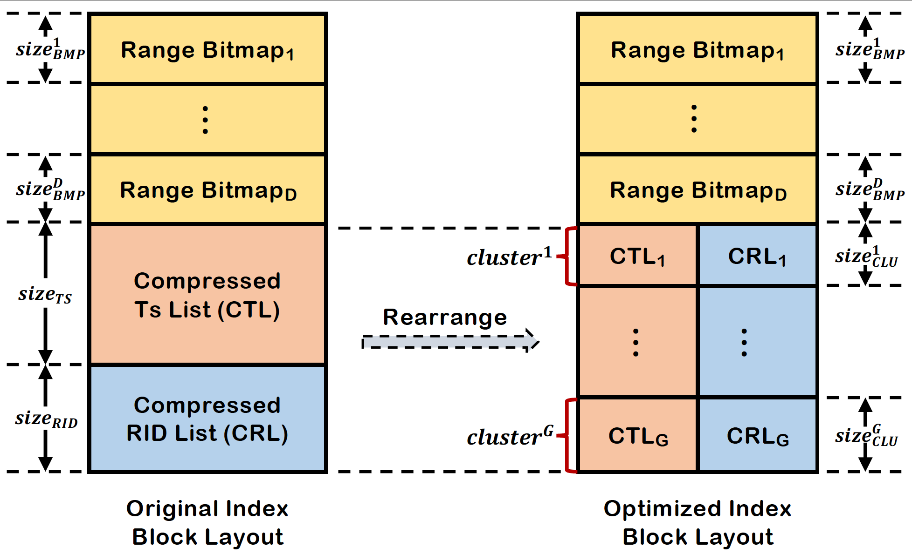

**Our extended version is planned be submitted to a  journal**

- What are the new/important contributions of the submitted paper (beyond our previous publication)?
  * Support out-of-order insertion (still avoid sort operation during query)
  * Support update and deletion operations (logical rather than physical)
  * Optimize index block layout and its reading operation
  * Discuss how to handle special operators, i.e., negation and kleene operators
  * Analyze time and space complexity for the query algorithm of ACER
  * Conduct comprehensive experiments to verify the performance of ACER

- What is the new content and in which sections does this content appear in the submission?
  * Update and deletion
  * Optimization (note that this subsection has new content): optimization of index block layout (i.e., arrange content in cluster-granularity) 
    and optimization of index block reading (i.e., read index blocks on demand)
  * Analysis and discussion (i.e.,  time and space complexity and special operator processing)
  * More experiments include: (1) parameter setting; (2) impact of selectivity & window;
    (3) out-of-order insertion; (4) update & deletion; (5) special operators;


# Accelerating Complex Event Recognition via Range Bitmap-Based Indexes

### Summary

**ACER is a simple, but efficient method (the greatest truths is concise)
that uses bitmap index structures to accelerate [complex event recognition](https://www.gartner.com/en/information-technology/glossary/complex-event-processing).**

**ACER key ideas:**

* Using [range bitmap](https://richardstartin.github.io/posts/range-bitmap-index#implementing-a-range-index) to index attribute value
* Aggregating same type events as a cluster (for fine-grained compression),
  building synopsis information for each cluster to skip unnecessary access
* Developing two-phase filtering algorithm to avoid unnecessary disk access in indexes and events

**ACER characteristic：**

* Easy to implement
* Window-wise filtering
* Low insertion & query latency
* Low storage overhead

**Cite this paper**
```tex
@inproceedings{Liu2024,
  author = {Shizhe Liu and Haipeng Dai and Shaoxu Song and Meng Li and Jingsong Dai and Rong Gu and Guihai Chen},
  title = {{ACER: Accelerating Complex Event Recognition via Two-Phase Filtering under Range Bitmap-Based Indexes}},
  year = {2024},
  booktitle = {Proceedings of ACM SIGKDD conference on Knowledge Discovery and Data Mining},
  pages = {1933--1943},
  doi={https://doi.org/10.1145/3637528.3671814}
}
```

**News**
* [2025-6-1] We have conducted a significant refactoring of the entire project's code and added key comments.
* [2025-5-20] We have significantly optimized ACER on index block layout,
  and conducted more experiments to verify the performance of ACER.
* [2025-5-12] New feature: support update operation
* [2025-4-10] We appreciate [Richard Startin](https://github.com/richardstartin)'s comments,
  he pointed out that there are some errors in the detailed description of Range Bitmap in our KDD paper.
  We would like to apologize to the readers for this matter.
  We will fix these errors in our journal version.
* [2025-4-20] We have optimized NFA engine, i.e.,
  matched tuples to store references to an event rather than the entire event information
* [2024-9-11] New feature: support out-of-order insertion operation and deletion operation
* [2024-8-25] The original version of the code was partially completed by undergraduate students and has poor readability.
  To make the code logic clearer, the authors refactored key code and function segments.

**We thank all anonymous reviewers and readers for their valuable comments and suggestions!!!**

## Section 1 Running

Open ```ACER4CER``` folder with IDEA, then you can run the target java file (please decompress dataset files and create `store` folder).

**Example**. Suppose you want to run ```Test_ACER.java```,then you will see the code in the main function.

```java
public class Test_ACER {
    // we only give key code lines
    public static void main(String[] args) throws FileNotFoundException {
      // 1. create table, alter attribute range
      Test_ACER.createSchema(datasetName);
      // 2. create index
      Index index = Test_ACER.createIndex(datasetName);
      // 3. store events
      buildCost = Test_ACER.storeEvents(dataFilePath, index);
      // 4. read query file
      JSONArray jsonArray = JSONArray.fromObject(jsonFileContent);
      // 5. submit query and obtain output
      Test_ACER.indexBatchQuery(index, jsonArray);
    }
}
```

**Code Explanations**
* It first creates event schema, index structures, and constraint property value ranges based on the statement.
* Next, it reads the dataset file and stores events into disk.
* Then, it reads the query file (`[datasetName].json`).
* Finally, it executes the query using current method.

**Result Explanations (see `output` folder)**
```
122-th query starting...                  // 122-th query pattern
filter cost: 4.077ms                      // cost of pre-filtering out unrelated events
scan cost: 3.934ms                        // cost of scaning disk to obtain events
match cost: 9.219ms                       // cost of matching in evaluation engines
number of tuples: 268                     // number of matched tuples  
122-th query cost: 18ms.                  // pattern query latency
```

## Section 2 Program `ACER4CER`

### Section 2.1: Package

| Name      | Explanation                                                                |
|-----------|----------------------------------------------------------------------------|
| acer      | our solution for accelerating CER                                          |
| arrival   | arrivals parameters (all indexes methods dependent on event type arrivals) |
| automaton | non-determine finite automaton (NFA) for CER                               |
| baselines | three baselines: fullscan [improved version], naive index, interval scan   | 
| btree     | disk B+tree class that encapsulates the range query function interface     |
| common    | frequently used tool classes                                               |
| condition | predicate constraints                                                      |
| generator | it can automatically generate synthetic data or queries                    |
| pattern   | complex event query pattern                                                |
| query     | query statement, all queries stored in json file                           |
| store     | store event into a file                                                    |
| output    | result output file                                                         |

More details about baselines can refer to the following two papers:

[1] Erkang Zhu, Silu Huang, Surajit Chaudhuri. High-Performance Row Pattern Recognition Using Joins. In VLDB , 2023.

[2] Michael Körber, Nikolaus Glombiewski, Bernhard Seeger. Index-accelerated pattern matching in event stores. In SIGMOD, 2021.

### Section 2.2: Key java files for running

| Method       | Location                                                                         |
|--------------|----------------------------------------------------------------------------------|
| ACER         | [Test_ACER.java](src%2Fmain%2Fjava%2Facer%2FTest_ACER.java)                      |
| FullScan     | [Test_FullScanPlus.java](src%2Fmain%2Fjava%2Fbaselines%2FTest_FullScanPlus.java) |
| NaiveIndex   | [Test_NaiveIndex.java](src%2Fmain%2Fjava%2Fbaselines%2FTest_NaiveIndex.java)     |
| IntervalScan | [Test_IntervalScan.java](src%2Fmain%2Fjava%2Fbaselines%2FTest_IntervalScan.java) |


## Section 3: Layout of Index Block

When obtaining the query result of a variable, we only access one cluster from the Index Blocks, 
but we decompress the entire Ts and RID lists, which wastes computing resources.
To avoid this issue, we compress the Ts and RID lists at cluster-granularity rather than block-granularity.
Below figure illustrates the storage layout of the optimized Index Block, 
where $D$ denotes the number of indexed attributes and $G$ denotes the number of clusters stored in the Index Block.
When given the cluster ID, we can extract the Ts and RID lists of the target cluster based on their offset positions, 
which avoids the waste of computing resources.



We provide four compression algorithms for compression: fixed-length delta, delta-of-delta, delta-zigzag-varint, and delta-zigzag-simple8B.
Specifically,

[1] Zig-zag is to solve the problem of low coding efficiency for negative numbers by the varint algorithm.
Its principle is very simple. It moves the flag bit to the end and removes the extra 0 in the coding, so as to achieve the effect of compression.
For relatively small values, the compression efficiency is very high, but for large data, the efficiency may not be improved but may also be reduced.
Therefore, Zig-zag is often paired with Delta encoding, which works well to convert large numerical data into smaller ones.

[2] Delta-of-Delta (Delta2), also known as second-order differential encoding, Delta encoding is used again on the basis of Delta encoding, which is more suitable for encoding monotonically increasing or decreasing sequence data.
For example, 2,4,4,6,8 , 2,2,0,2,2 after delta encoding, and 2,0,-2,2,0 after delta encoding.

[3] Varint is a widely recognized technique used for compressing integer streams.
Essentially, it suggests that it can be more efficient to encode a number using a variable-length representation instead of a fixed-size binary representation.

[4] Simple8b is a 64-bit algorithm that implements compressing multiple integers (between 0 and 1<<60-1) into a 64-bit storage structure.
The first 4 bits represent the selector, and the last 60 bits are used to store data.
The advantage is that it is simple and efficient, and the fixed-length encoding ensures the decompression efficiency, but the compression rate is low for large integers or large floating values.
This algorithm is suitable for unsigned integers with a small range.


More details can see [Compressing Time Series Data](https://tdengine.com/compressing-time-series-data/)


## Section 4: Experimental Datasets

Our paper used both synthetic and real datasets.
We provided the download URLs for the real dataset.


###  Section 4.1 Real-world datasets

**Real-world dataset overview**

| Name                                                                                                | Columns | Event number | File size |
|-----------------------------------------------------------------------------------------------------| - | - | - |
| [JOB](https://github.com/google/cluster-data)                                                       | timestamp,job_id,event_type,username,scheduling_class,job_name | 2.0M | 57.4MB |
| [CRIMES](https://data.cityofchicago.org/Public-Safety/Crimes-2001-to-present-Dashboard/5cd6-ry5g)   |      primaryType, ID, beat, district, latitude, longitude, date | 7.6M | 493.5MB |
| [NASDAQ](https://www.eoddata.com)                                                                   | ticker,open, high, low, close, vol, date | 8.7M | 418MB  |

- For `Google cluster` dataset, we choose six attributes from the job table. Then we choose one attribute to index: `scheduling class`.

- For `Crime` dataset, we choose 7 columns ```Primary Type (String), ID (int), Beat (int), District(int), Latitude (Double.9), Longitude (Double.9), Date (Date format)```. We transform the date to a timestamp and sort the record according to the timestamp. We choose index attributes as follows: `Beat, District, Latitude, Longitude`.

- For `NASDAQ` dataset, we only choose 15 famous stocks (*e,g,* MSFT, GOOG, AAPL, TSLA, *et.al.*) rather than all stocks. The dataset records each stock price change per minute in trade time.

### Section 4.2  Synthetic dataset

We have written a synthetic data generator to automatically generate synthetic data of a specified size. `Generator` folder has a `SyntheticQueryGenerator.java` file that can generate synthetic datasets.

**Schema:** `(String type,int a1, int a2, double a3, double a4, long timestamp)`

**Generator setting**
```
zipf alpha= 1.2
a1 ~ Uniform[0,1000]
a2 ~ Uniform[0,1000]
a3 ~ Guass[5000,1000]
a4 ~ Guass[5000,1000]

each variable has 2 independent constraints (defualt selectivity: 10%)
each query has 1~3 dependent constraints
```
Suppose the probability of occurrence of event types follows a `Zipf` distribution. The difference in timestamps for each adjacent record is 1. We generated 3 synthetic datasets, they contain 10_000_000 (10M), 100_000_000 (100M) and 1_000_000_000 (1G) events, respectively.

The following table provides detailed information on how to build indexes for each method:

| Dataset   | Method       | Columns that require index construction                     |
|-----------|--------------| ----------------------------------------------------------- |
| JOB       | ACER         | scheduling Class                                            |
|           | IntervalScan | scheduling Class, type, timestamp                           |
|           | NaiveIndex   | scheduling Class, type                                      |
| NASDAQ    | ACER         | open, vol                                                   |
|           | IntervalScan | open, vol, ticker, date                                     |
|           | NaiveIndex   | open, vol, ticker                                           |
| Crimes    | ACER         | beat, district, latitude, longtitude                        |
|           | IntervalScan | beat, district, latitude, longitude, primaryType, timestamp |
|           | NaiveIndex   | beat, district, latitude, longitude, primaryType            |
| Synthetic | ACER         | a1, a2, a3                                                  |
|           | IntervalScan | a1, a2, a3, type, timestamp                                 |
|           | NaiveIndex   | a1, a2, a3, type                                            |

### Section 5: DBMS and Flink Experiments

**Unless otherwise stated, events are timestamp-ordered.**

We used a leading commercial database (referred to as `DBMS` here due to copyright issues) and `Flink` to perform some queries on the Crimes dataset, and we found that the query results were different from `DBMS` and `Flink`. However, this does not mean that our code has a bug. The reasons for different query results are as follows:

* In order to support skip irrelevant events between two variables, `DBMS` needs to use wildcards (e.g.`*`) for querying. When wildcard matches are used, extreme greedy strategies are used for matching, which is not equivalent to  `skip-till-next-match`. DBMS currently does not seem to support `skip-till-any-match` strategy.
* For  `skip-till-next-match` and `skip-till-any-match`, `Flink` first sorts events based on their timestamps. When two different events have the same timestamp, their sorting position may differ from the initial order, resulting in mismatched results. **If the timestamp of each event is different, then the answer queried by Flink must be the same as the answer queried by ACER.**

### Section 5.1 DBMS example for CRIMES dataset

**Create schema**

```sql
CREATE TABLE Crimes( 
  primary_type VARCHAR(64), 
  id int, 
  beat int NOT NULL, 
  dis int NOT NULL, 
  lat Binary_double, 
  lon Binary_double, 
  timestamp NUMBER NOT NULL 
);
```

**Original Query (poor efficiency)**

```sql
SELECT * FROM Crimes MATCH_RECOGNIZE(
    MEASURES R.id AS RID, B.id AS BID, M.id AS MID
    ONE ROW PER MATCH
    AFTER MATCH SKIP TO NEXT ROW
    PATTERN (R Z* B Z* M)
    DEFINE 
        R AS R.primary_type = 'ROBBERY',
        B AS B.primary_type = 'BATTERY'
            AND B.lon BETWEEN R.lon - 0.05 AND R.lon + 0.05
            AND B.lat BETWEEN R.lat - 0.02 AND R.lat + 0.02,
        M AS M.primary_type = 'MOTOR_VEHICLE_THEFT'
            AND M.lon BETWEEN R.lon - 0.05 AND R.lon + 0.05
            AND M.lat BETWEEN R.lat - 0.02 AND R.lat + 0.02
            AND M.timestamp - R.timestamp <= 1800
);
```

**Improved Query**

```sql
WITH filter_events AS(
    SELECT primary_type, id, lat, lon, timestamp
    FROM Crimes
    WHERE primary_type = 'ROBBERY' 
       OR primary_type = 'BATTERY' 
       OR primary_type = 'MOTOR_VEHICLE_THEFT'
)
SELECT * 
FROM filter_events MATCH_RECOGNIZE(
    MEASURES R.id AS RID, B.id AS BID, M.id AS MID
    ONE ROW PER MATCH
    AFTER MATCH SKIP TO NEXT ROW
    PATTERN (R Z* B Z* M)
    DEFINE 
        R AS R.primary_type = 'ROBBERY',
        B AS B.primary_type = 'BATTERY'
            AND B.lon BETWEEN R.lon - 0.05 AND R.lon + 0.05
            AND B.lat BETWEEN R.lat - 0.02 AND R.lat + 0.02
            AND B.timestamp - R.timestamp <= 1800,
        M AS M.primary_type = 'MOTOR_VEHICLE_THEFT'
            AND M.lon BETWEEN R.lon - 0.05 AND R.lon + 0.05
            AND M.lat BETWEEN R.lat - 0.02 AND R.lat + 0.02
            AND M.timestamp - R.timestamp <= 1800
);
```

**Join-based Query (please see VLDB'23 - High-Performance Row Pattern Recognition Using Joins)**

```sql
WITH input_bucketized AS(
  SELECT primary_type, id, lat, lon, timestamp, FLOOR(timestamp / 1800) AS bk
  FROM Crimes
), filter_r AS(
  SELECT FLOOR(timestamp / 1800) AS bk
  FROM Crimes
  WHERE primary_type = 'ROBBERY'
), filter_m AS(
  SELECT FLOOR(timestamp / 1800) AS bk
  FROM Crimes
  WHERE primary_type = 'MOTOR_VEHICLE_THEFT'
), ranges AS(
  SELECT R.bk AS bk_s, M.bk AS bk_e
  FROM filter_r R, filter_m M
  WHERE R.bk = M.bk
  UNION
  SELECT R.bk AS bk_s, M.bk AS bk_e
  FROM filter_r R, filter_m M
  WHERE R.bk + 1 = M.bk
), buckets AS(
  SELECT DISTINCT n FROM ranges
  CROSS JOIN generate_series(bk_s, bk_e)
  ORDER by n
), prefilter AS(
  SELECT i.*
 FROM input_bucketized i, buckets b
 WHERE i.bk = b.n
)
SELECT *
FROM prefilter MATCH_RECOGNIZE(
    MEASURES R.id AS RID, B.id AS BID, M.id AS MID
    ONE ROW PER MATCH
    AFTER MATCH SKIP TO NEXT ROW
    PATTERN (R Z* B Z* M)
    DEFINE 
        R AS R.primary_type = 'ROBBERY',
        B AS B.primary_type = 'BATTERY'
            AND B.lon BETWEEN R.lon - 0.05 AND R.lon + 0.05
            AND B.lat BETWEEN R.lat - 0.02 AND R.lat + 0.02
            AND B.timestamp - R.timestamp <= 1800,
        M AS M.primary_type = 'MOTOR_VEHICLE_THEFT'
            AND M.lon BETWEEN R.lon - 0.05 AND R.lon + 0.05
            AND M.lat BETWEEN R.lat - 0.02 AND R.lat + 0.02
            AND M.timestamp - R.timestamp <= 1800
);
```

### Section 5.2 Flink example for crimes dataset

```java
Pattern<CrimesEvent, ?> pattern = Pattern.<CrimesEvent>begin("v0").where(
        new SimpleCondition<CrimesEvent>() {
            @Override
            public boolean filter(CrimesEvent event){
                return event.getPrimaryType().equals("ROBBERY");
            }
        }
).followedByAny("v1").where(
        new IterativeCondition<CrimesEvent>() {
            @Override
            public boolean filter(CrimesEvent event, Context<CrimesEvent> ctx) throws Exception {
                boolean ic = event.getPrimaryType().equals("BATTERY");
                boolean dc = false;
                for(CrimesEvent v0Event : ctx.getEventsForPattern("v0")){
                    dc = event.getLongitude() >= v0Event.getLongitude() - 0.05 &&
                            event.getLongitude() <= v0Event.getLongitude() + 0.05 &&
                            event.getLatitude() >= v0Event.getLatitude() - 0.02 &&
                            event.getLatitude() <= v0Event.getLatitude() + 0.02;
                }
                return dc && ic;
            }
        }
).followedByAny("v2").where(
        new IterativeCondition<CrimesEvent>() {
            @Override
            public boolean filter(CrimesEvent event, Context<CrimesEvent> ctx) throws Exception {
                boolean ic = event.getPrimaryType().equals("MOTOR_VEHICLE_THEFT");
                boolean dc = false;
                for(CrimesEvent v0Event : ctx.getEventsForPattern("v0")){
                    dc = event.getLongitude() >= v0Event.getLongitude() - 0.05 &&
                            event.getLongitude() <= v0Event.getLongitude() + 0.05 &&
                            event.getLatitude() >= v0Event.getLatitude() - 0.02 &&
                            event.getLatitude() <= v0Event.getLatitude() + 0.02;
                }
                return dc && ic;
            }
        }
).within(Time.milliseconds(108001));
```

### Section 5.3 DBMS example for NASDAQ dataset

**Create schema**

```sql
CREATE TABLE Crimes( 
  ticker VARCHAR(16), 
  open Binary_double, 
  high Binary_double,
  low Binary_double,
  close Binary_double,
  vol int NOT NULL, 
  timestamp NUMBER NOT NULL 
);
```

**Original Query (poor efficiency)**

```sql
SELECT * FROM NASDAQ MATCH_RECOGNIZE(
    MEASURES V1.timestamp AS T1, V2.timestamp AS T2, V3.timestamp AS T3, V4.timestamp AS T4
    ONE ROW PER MATCH
    AFTER MATCH SKIP TO NEXT ROW
    PATTERN (V1 Z* V2 Z* V3 Z* V4)
    DEFINE 
        V1 AS V1.ticker = 'MSFT' AND V1.open BETWEEN 326 AND 334,
        V2 AS V2.ticker = 'GOOG' AND V2.open BETWEEN 120 AND 130,
  		  V3 AS V3.ticker = 'MSFT' AND V3.open >= V1.open * 1.007,
        V4 AS V4.ticker = 'GOOG' AND V4.open <= V2.open * 0.993,
            AND V4.timestamp - V1.timestamp <= 720
);
```

**Improved Query**

```sql
WITH filter_events AS(
    SELECT ticker, open, timestamp
    FROM NASDAQ
    WHERE primary_type = 'MSFT' OR primary_type = 'GOOG'
)
SELECT * 
FROM filter_events MATCH_RECOGNIZE(
    MEASURES V1.timestamp AS T1, V2.timestamp AS T2, V3.timestamp AS T3, V4.timestamp AS T4
    ONE ROW PER MATCH
    AFTER MATCH SKIP TO NEXT ROW
    PATTERN (V1 Z* V2 Z* V3 Z* V4)
    DEFINE 
        V1 AS V1.ticker = 'MSFT' 
            AND V1.open BETWEEN 326 AND 334,
        V2 AS V2.ticker = 'GOOG' 
            AND V2.open BETWEEN 120 AND 130
            AND V2.timestamp - V1.timestamp <= 720,
  		  V3 AS V3.ticker = 'MSFT' 
            AND V3.open >= V1.open * 1.007
            AND V3.timestamp - V1.timestamp <= 720,
        V3 AS V3.ticker = 'GOOG' 
            AND V4.open <= V2.open * 0.993 
            AND V4.timestamp - V1.timestamp <= 720
);
```

**Join-based  Query (please see VLDB'23 - High-Performance Row Pattern Recognition Using Joins)**

```sql
WITH input_bucketized AS(
  SELECT ticker, open, timestamp, FLOOR(timestamp / 720) AS bk
  FROM NASDAQ
), filter_v1 AS(
  SELECT bk
  FROM input_bucketized
  WHERE ticker = 'MSFT' AND open BETWEEN 325 AND 335
), filter_v3 AS(
  SELECT bk
  FROM input_bucketized
  WHERE ticker = 'GOOG' AND open BETWEEN 120 AND 130
), ranges AS(
  SELECT V1.bk AS bk_start, V3.bk AS bk_end
  FROM filter_v1 V1, filter_v3 V3
  WHERE V1.bk = V3.bk
  UNION
  SELECT V1.bk AS bk_start, V3.bk AS bk_end
  FROM filter_v1 V1, filter_v3 V3
  WHERE V1.bk + 1 = V3.bk
), buckets AS(
  SELECT DISTINCT n FROM ranges
  CROSS JOIN generate_series(bk_start, bk_end + 1)
), prefilter AS(
  SELECT i.*
  FROM input_bucketized i, buckets b
  WHERE i.bk = b.n
  ORDER BY timestamp
)
SELECT COUNT(*) 
FROM prefilter MATCH_RECOGNIZE(
    MEASURES V1.timestamp AS T1, V2.timestamp AS T2, V3.timestamp AS T3, V4.timestamp AS T4
    ONE ROW PER MATCH
    AFTER MATCH SKIP TO NEXT ROW
    PATTERN (V1 Z* V2 Z* V3 Z* V4)
    DEFINE 
        V1 AS V1.ticker = 'MSFT' AND V1.open BETWEEN 325 AND 335,
        V2 AS V2.ticker = 'GOOG' AND V2.open BETWEEN 120 AND 130,
        V3 AS V3.ticker = 'MSFT' AND V3.open >= V1.open * 1.003,
        V4 AS V4.ticker = 'GOOG' AND V4.open <= V2.open * 0.997
            AND V4.timestamp - V1.timestamp <= 720
);
```
